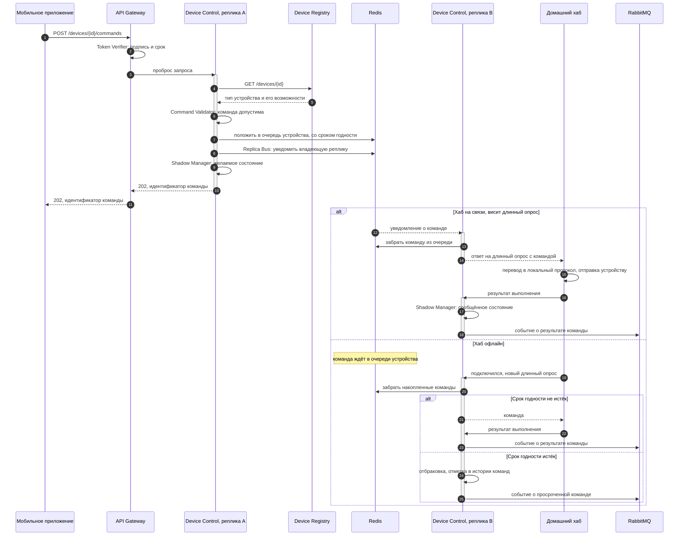

# Диаграмма кода — доставка команды до устройства

Критический путь продукта: пользователь нажал кнопку, устройство отработало. Здесь сходятся все принятые решения — приём команды любой репликой, очередь устройства, передача через Redis нужной реплике, выдача в висящий длинный опрос и срок годности команды.

## Что показывает

**Приём команды не зависит от соединения.** Реплика A отвечает клиенту 202 сразу после того, как команда легла в очередь. Она не знает и не должна знать, доступен ли дом прямо сейчас.

**Передача между репликами.** Соединение с хабом держит реплика B, а команду приняла A. Связка «очередь плюс уведомление через Redis» решает это без привязки хаба к конкретной реплике на балансировщике.

**Длинный опрос работает как push.** Хаб почти всегда висит в ожидании ответа, поэтому команда уходит в дом практически мгновенно — даже когда приложение закрыто и WebSocket не поднят.

**Срок годности проверяется при выдаче, а не при постановке.** Команда, пролежавшая в очереди дольше положенного, до дома не доезжает: «включить свет в 22:00» не должно срабатывать в час ночи.

**Два состояния устройства обновляются в разные моменты.** Желаемое — сразу при приёме команды, сообщённое — только после подтверждения от хаба. Расхождение между ними и есть ответ на вопрос «команда отдана, а устройство офлайн».
