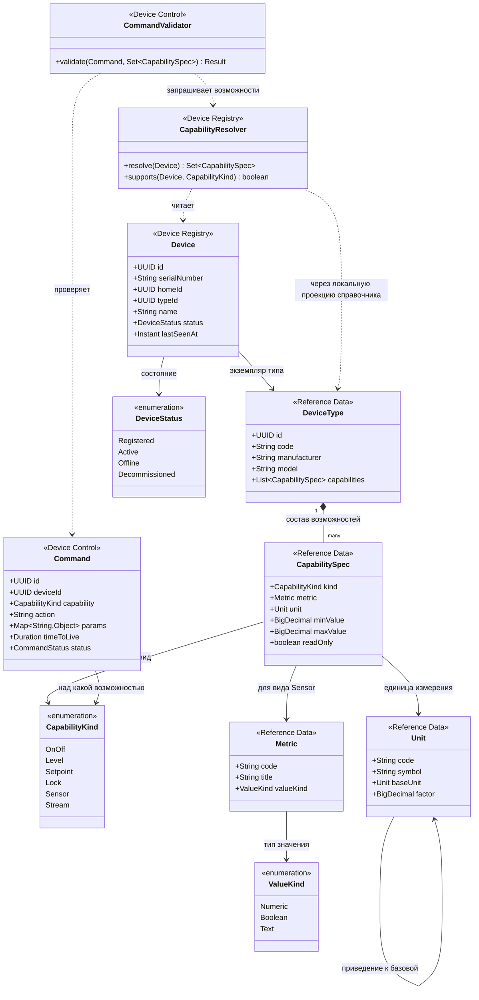

# Диаграмма кода — модель возможностей устройств

Ключевое архитектурное решение всей работы. Устройство описывается не типом, а набором возможностей: «включить свет» и «отпереть ворота» — это одна и та же команда над разными возможностями, а не два сервиса. Подключение нового типа устройства партнёра сводится к записи в справочнике и не требует релиза.

## Как это работает

Справочник владеет тем, **что вообще бывает**: типы устройств, их возможности, метрики и единицы. Реестр владеет тем, **что есть у конкретного пользователя**: экземпляр устройства со ссылкой на тип. Device Control владеет **командой** и проверяет её допустимость через возможности.

Проверка команды выглядит так: `CommandValidator` берёт у `CapabilityResolver` набор `CapabilitySpec` для устройства и убеждается, что среди них есть нужный `CapabilityKind`, а параметры укладываются в заданный диапазон. Запереть лампу не получится — у её типа нет возможности `Lock`.

**Почему возможности лежат в справочнике, а не в коде.** Добавление нового типа устройства — это строка в `DeviceType` и несколько строк в `CapabilitySpec`. Ни реестр, ни Device Control при этом не меняются и не пересобираются. Именно так закрывается требование ТЗ про «будущее неуточнённое поведение» и подключение партнёрских устройств.

**Почему `Unit` ссылается сам на себя.** Единицы приводятся к базовой через множитель: чтобы агрегаты по температуре считались корректно, показания в разных шкалах надо привести к одной. Этим занимается Unit Normalizer в телеметрии.

**Почему у метрики есть `ValueKind`.** Не всякое измерение — число: датчик движения отдаёт булево значение, геркон — состояние «открыто или закрыто». Значения хранятся отдельными колонками по типу, без универсального JSON-поля, чтобы по числовым рядам можно было дёшево считать агрегаты.
