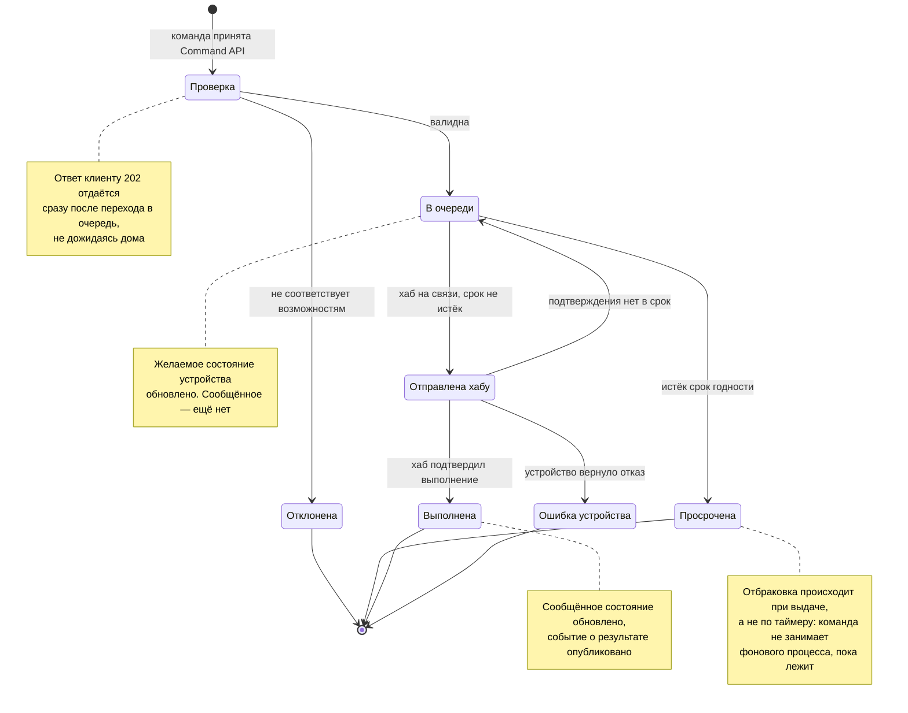

# Диаграмма кода — жизненный цикл команды

Дополняет диаграмму доставки и отвечает на вопрос, который задают первым: что значит «команда отдана», если устройство в этот момент недоступно.

## Разбор переходов

| Переход | Когда | Что происходит ещё |
|---|---|---|
| → Проверка | Command API принял запрос | — |
| Проверка → Отклонена | команда не соответствует возможностям устройства | клиент получает отказ синхронно, 4xx |
| Проверка → В очереди | команда валидна | желаемое состояние обновлено, клиенту 202 |
| В очереди → Отправлена | хаб пришёл за командами и срок годности не истёк | — |
| В очереди → Просрочена | срок годности истёк к моменту выдачи | отметка в истории, событие в брокер |
| Отправлена → Выполнена | хаб подтвердил успех | сообщённое состояние обновлено, событие в брокер |
| Отправлена → Ошибка | устройство вернуло отказ | событие в брокер, сообщённое состояние не меняется |
| Отправлена → В очереди | подтверждение не пришло в срок | повтор доставки, счётчик попыток |

## Что из этого следует

**Отклонение и просрочка — разные исходы.** Первое синхронно и видно клиенту сразу: команда бессмысленна для этого устройства. Второе асинхронно и наступает позже: команда была осмысленной, но потеряла актуальность.

**Возврат из «Отправлена» в «В очереди» — единственный цикл на диаграмме.** Он нужен, потому что хаб может получить команду и пропасть до подтверждения. Без ограничения на число попыток этот цикл станет бесконечным, поэтому у команды есть счётчик, а исчерпание попыток переводит её в «Ошибка устройства».

**Срок годности зависит от типа команды.** Для уставки отопления он длинный: включить отопление с опозданием почти всегда лучше, чем не включить. Для света и ворот короткий: сработавшая ночью команда из вечера вредна, а открывшиеся без хозяина ворота — опасны.
