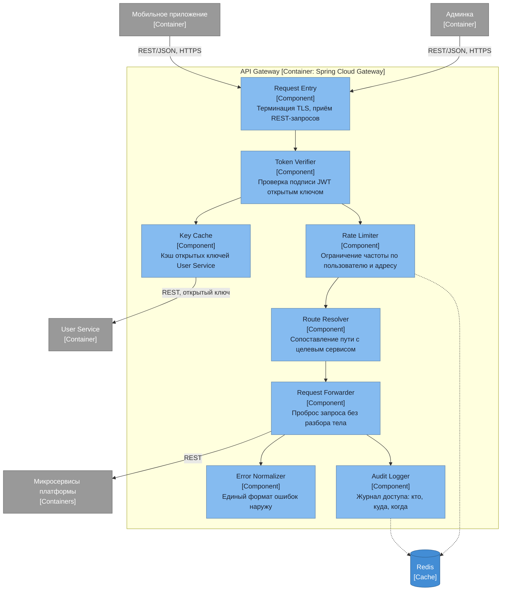

# Диаграмма компонентов — API Gateway

## Ответственности компонентов

| Компонент | Ответственность |
|---|---|
| Request Entry | Терминация TLS, разбор заголовков, единая точка входа снаружи |
| Token Verifier | Проверка подписи и срока действия JWT, отклонение неавторизованных запросов |
| Key Cache | Хранение открытых ключей User Service, периодическое обновление |
| Rate Limiter | Счётчики частоты обращений по пользователю и адресу, отсечение злоупотреблений |
| Route Resolver | Определение целевого сервиса по пути запроса |
| Request Forwarder | Передача запроса дальше без разбора тела — шлюз не знает контрактов сервисов |
| Error Normalizer | Приведение ошибок сервисов к единому формату ответа |
| Audit Logger | Запись факта доступа для разбора инцидентов |

Бизнес-логики в шлюзе нет сознательно: он занимается только сквозными задачами. Собственной базы у него тоже нет — счётчики и журнал живут в Redis.
