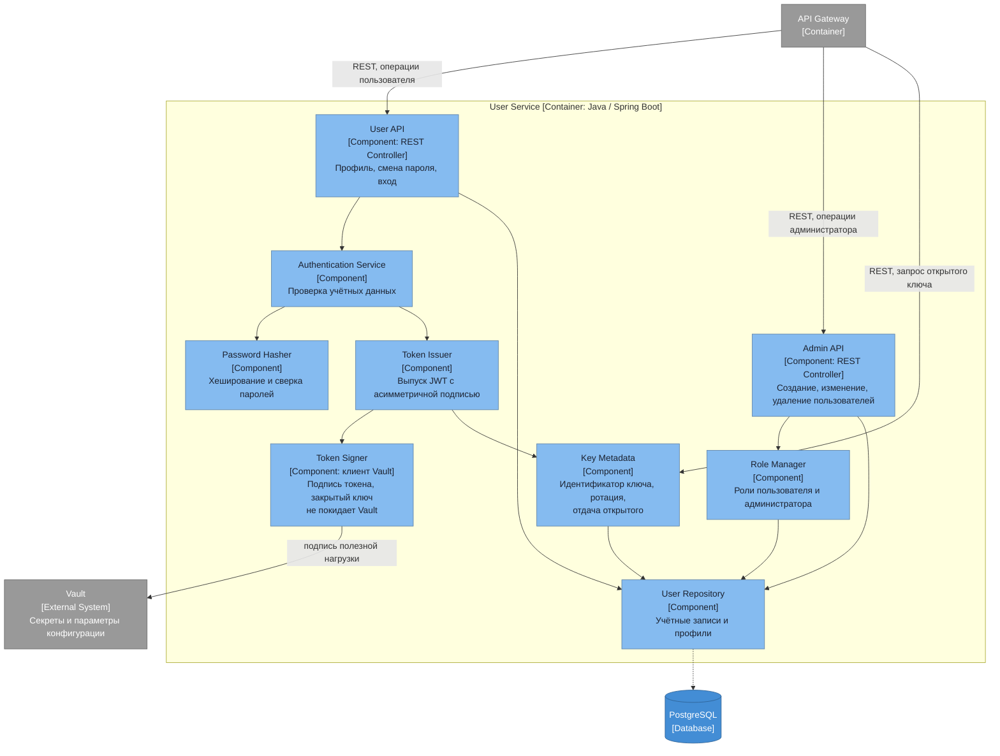

# Диаграмма компонентов — User Service

## Ответственности компонентов

| Компонент | Ответственность |
|---|---|
| User API | Операции самого пользователя: профиль, смена пароля, вход |
| Admin API | Операции администратора: создание, редактирование и удаление пользователей |
| Authentication Service | Проверка учётных данных при входе |
| Password Hasher | Хеширование паролей и сверка при входе, пароли в открытом виде не хранятся |
| Token Issuer | Выпуск JWT с асимметричной подписью, срок жизни и состав полезной нагрузки |
| Token Signer | Подпись токена во внешнем Vault: полезная нагрузка уходит туда, обратно приходит подпись. Закрытый ключ не попадает ни в базу, ни в память сервиса |
| Key Metadata | Идентификатор ключа, срок действия, ротация и отдача открытого ключа шлюзу |
| Role Manager | Роли пользователя и администратора |
| User Repository | Доступ к собственной базе учётных записей |

Токены выпускает этот сервис, проверяет их шлюз. Общего секрета между сервисами нет — только открытый ключ, который можно раздавать свободно.

Закрытый ключ подписи в базе не хранится. Он живёт в Vault, и подпись выполняется там же: Token Signer отправляет полезную нагрузку и получает подпись обратно. В собственной базе остаются только метаданные ключа и открытая часть. Иначе закрытый ключ лежал бы в одной базе с таблицей учётных записей, и одна утечка давала бы возможность беззвучно выпускать токены от имени кого угодно.

Полномочия администратора ограничены учётными записями: создание, изменение, удаление, назначение ролей. Доступа к домам, устройствам и телеметрии пользователей у него нет — права нигде не пересекают границу арендатора, и отдельный механизм доступа поддержки не нужен.
