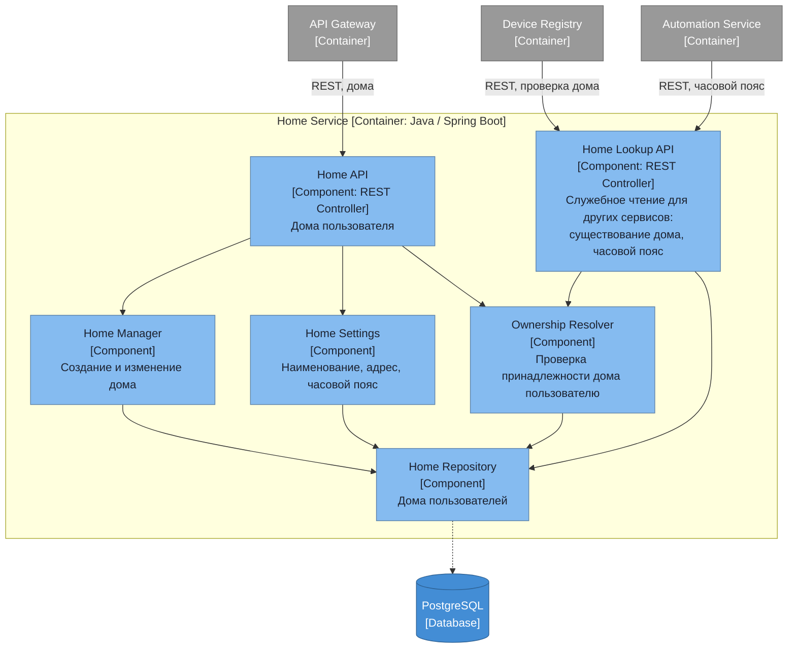

# Диаграмма компонентов — Home Service

## Ответственности компонентов

| Компонент | Ответственность |
|---|---|
| Home API | Список домов пользователя, создание и изменение дома |
| Home Manager | Жизненный цикл дома: создание, переименование, удаление |
| Home Settings | Наименование, адрес и часовой пояс дома — часовой пояс нужен сценариям по расписанию |
| Ownership Resolver | Источник истины по вопросу «этот дом принадлежит этому пользователю» |
| Home Lookup API | Служебное чтение для соседних сервисов: Device Registry подтверждает существование дома при регистрации устройства, Automation забирает часовой пояс для расписаний. Отделено от пользовательского Home API, потому что вызывается сервисами, а не приложением |
| Home Repository | Доступ к собственной базе домов |

Дом считается единым пространством: деления на помещения нет, устройство привязывается прямо к дому. Это убирает из модели целый уровень — классификатор помещений, их создание и перенос устройств между ними.

Делегирования прав тоже нет: у дома один владелец, поэтому проверка доступа сводится к одному вопросу и живёт в единственном компоненте.
