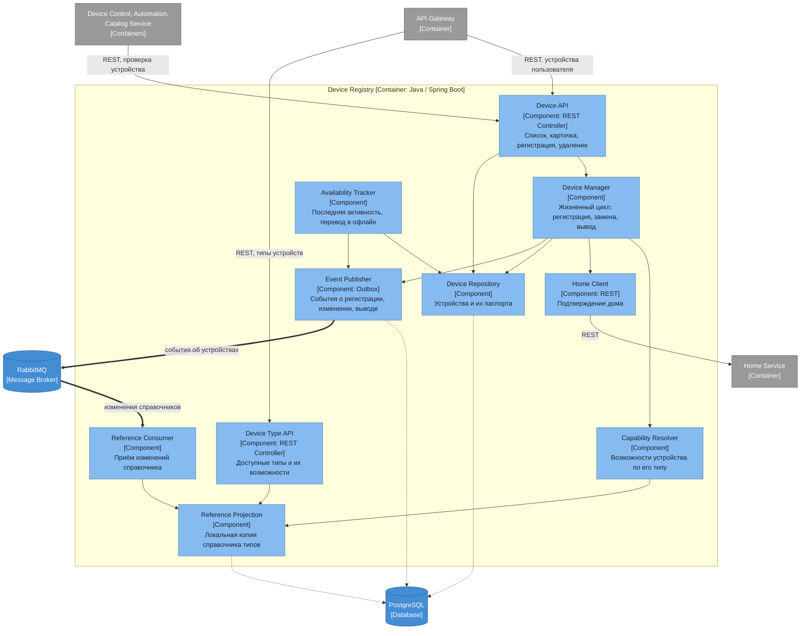

# Диаграмма компонентов — Device Registry

## Ответственности компонентов

| Компонент | Ответственность |
|---|---|
| Device API | Устройства пользователя: список, карточка, регистрация, удаление |
| Device Type API | Выдача доступных типов устройств и их возможностей при подключении нового устройства |
| Device Manager | Жизненный цикл устройства: регистрация, замена, вывод из эксплуатации |
| Capability Resolver | Определение набора возможностей конкретного устройства по его типу |
| Reference Projection | Локальная копия справочника типов и возможностей — синхронных походов в Reference Data нет |
| Home Client | Подтверждение существования дома при регистрации устройства |
| Availability Tracker | Отметка последней активности и перевод устройства в офлайн при длительном молчании |
| Device Repository | Доступ к собственной базе устройств |
| Event Publisher | Публикация событий об устройствах через outbox, чтобы событие не терялось между коммитом и отправкой |
| Reference Consumer | Приём изменений справочника и обновление локальной проекции |

Этот сервис вырастает из CRUD монолита: `sensors` разрезается по вертикали, и сюда уходят паспорт устройства и его размещение, а значения измерений — в Telemetry.
