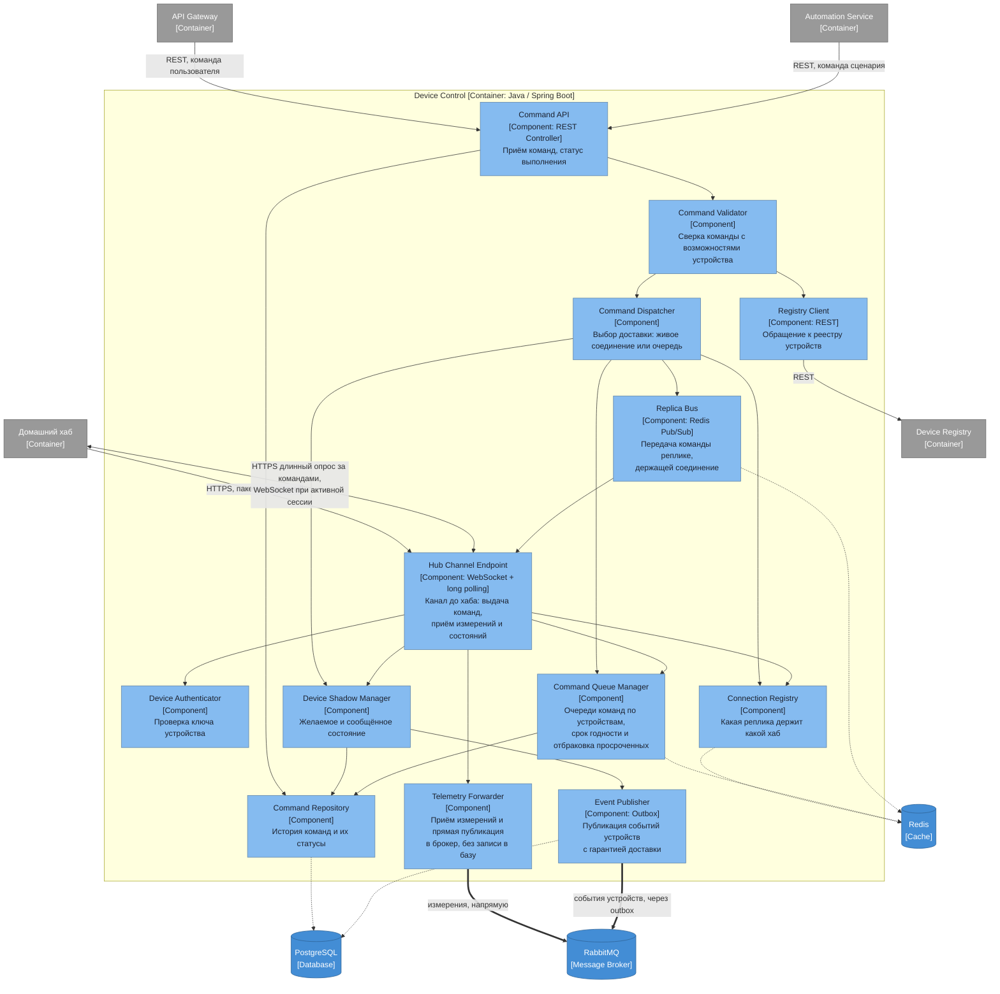

# Диаграмма компонентов — Device Control

## Ответственности компонентов

| Компонент | Ответственность |
|---|---|
| Command API | Приём команд от пользователя и от сценариев, выдача статуса выполнения |
| Hub Channel Endpoint | Единственная точка связи с домом. Приём пакетов измерений отдельным запросом, длинный опрос за командами, WebSocket при активной сессии |
| Device Authenticator | Проверка ключа устройства — контур безопасности, отдельный от пользовательского токена |
| Command Validator | Сверка команды с возможностями устройства: нельзя запереть лампу |
| Command Dispatcher | Решение о способе доставки — отдать в живое соединение или оставить в очереди |
| Device Shadow Manager | Желаемое и сообщённое состояние устройства, ответ на вопрос «команда отдана, но устройство офлайн» |
| Telemetry Forwarder | Приём измерений от хаба и публикация их в брокер напрямую, с подтверждением от брокера, но без записи в собственную базу |
| Connection Registry | Учёт того, какая реплика держит соединение с каким хабом — снимает необходимость привязки на балансировщике |
| Replica Bus | Доставка команды до реплики, держащей соединение, если команду приняла другая реплика |
| Command Queue Manager | Очереди команд по устройствам, чтобы приём команды не зависел от наличия соединения. Здесь же срок годности: просроченная команда до дома не доезжает |
| Command Repository | История команд и их статусов |
| Registry Client | Обращение к реестру за паспортом и возможностями устройства |
| Event Publisher | Публикация событий устройств через outbox: регистрация, смена состояния, результат команды |

Два входа разведены сознательно: у пользовательского REST и у канала до хаба разная аутентификация, разная частота обращений и разный жизненный цикл соединения.

Измерения и события устройств публикуются по-разному, и это не случайность. Событие о смене состояния терять нельзя — проекции в других сервисах разъедутся навсегда, поэтому оно проходит через outbox: сначала запись в базу в одной транзакции с изменением, потом отправка. Измерения же представляют собой поток, где потеря единичного значения терпима, а объём максимален в системе. Гонять каждое показание через запись в PostgreSQL значило бы удвоить нагрузку на самом горячем пути и сделать базу Device Control узким местом для всех домов сразу, поэтому Telemetry Forwarder публикует их в брокер напрямую.

Измерения приходят отдельным запросом, а не внутри длинного опроса. Иначе их отправка привязалась бы к циклу опроса и задержалась бы на время удержания запроса: хаб не может отправить данные, пока висит в ожидании команды.

Команду может принять любая реплика, а соединение с нужным хабом держит, вообще говоря, другая. Поэтому доставка идёт в два шага: команда кладётся в очередь устройства, после чего Replica Bus публикует уведомление владеющей реплике через Redis. Балансировщику знать о привязке не нужно, реплики добавляются и выводятся свободно, а падение реплики теряет только сокеты — хабы переподключаются к любой другой и забирают накопленное из очереди.

У команды есть срок годности. Если дом был офлайн несколько часов, «включить свет в 22:00» не должно сработать в час ночи: просроченная команда отбраковывается при выдаче и отмечается в истории как неисполненная. Срок задаётся типом команды — для уставки отопления он длинный, для света и ворот короткий.
