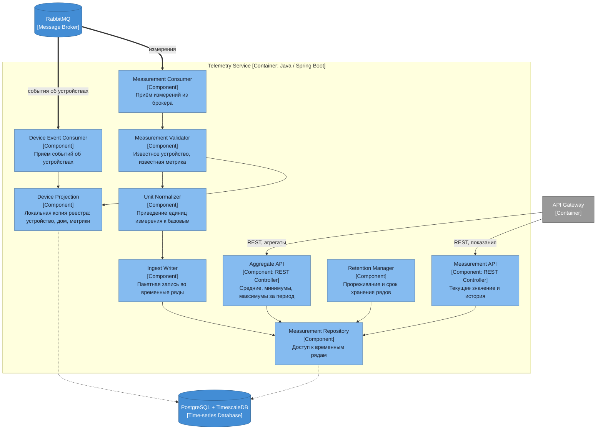

# Диаграмма компонентов — Telemetry Service

## Ответственности компонентов

| Компонент | Ответственность |
|---|---|
| Measurement API | Текущее значение и история измерений по устройству и метрике |
| Aggregate API | Агрегаты за период: средние, минимумы, максимумы |
| Measurement Consumer | Приём потока измерений из брокера |
| Measurement Validator | Отсев измерений от неизвестных устройств и по неизвестным метрикам |
| Unit Normalizer | Приведение единиц к базовым, чтобы агрегаты считались корректно |
| Ingest Writer | Пакетная запись во временные ряды — по одному измерению писать дорого |
| Device Projection | Локальная копия реестра: идентификатор, дом, набор метрик |
| Device Event Consumer | Обновление проекции по событиям реестра |
| Retention Manager | Прореживание старых рядов и удаление по сроку хранения |
| Measurement Repository | Доступ к гипертаблице измерений |

Синхронных вызовов в Device Registry на пути приёма измерений нет: проверка идёт по локальной проекции. Реестр может быть недоступен — поток данных от этого не прервётся.

Ключ измерения — пара «устройство и метрика», а не одно устройство: комбинированный датчик отдаёт температуру и влажность одновременно. Не-числовые значения (движение, открыто-закрыто) хранятся отдельными колонками, без JSONB.
