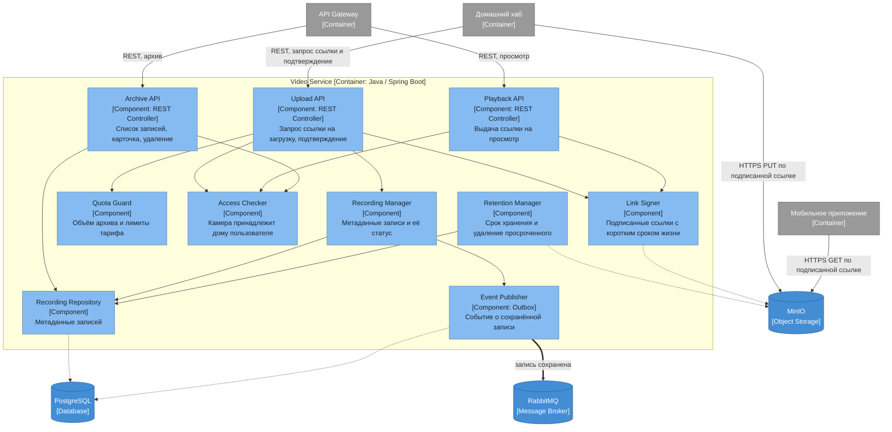

# Диаграмма компонентов — Video Service

## Ответственности компонентов

| Компонент | Ответственность |
|---|---|
| Archive API | Список записей по камере и периоду, карточка записи, удаление |
| Upload API | Выдача ссылки на загрузку и приём подтверждения о завершении |
| Playback API | Выдача ссылки на просмотр конкретной записи |
| Link Signer | Формирование подписанных ссылок к MinIO с коротким сроком жизни |
| Quota Guard | Контроль объёма архива по тарифу до выдачи ссылки на запись |
| Access Checker | Проверка того, что камера относится к дому пользователя |
| Recording Manager | Метаданные записи и переход её статуса из «ожидается» в «сохранено» |
| Retention Manager | Удаление записей и файлов по истечении срока хранения |
| Recording Repository | Доступ к базе метаданных |
| Event Publisher | Публикация факта сохранения записи |

Сервис не пропускает через себя байты видео: он только решает, можно ли писать и читать, и выдаёт подписанную ссылку. Файл идёт от хаба в MinIO и из MinIO в приложение напрямую.

Живой поток в объём не входит — распознавание движения выполняется на камере или хабе, а событие идёт обычным путём устройства через Device Control. Video Service публикует только факт появления новой записи.
