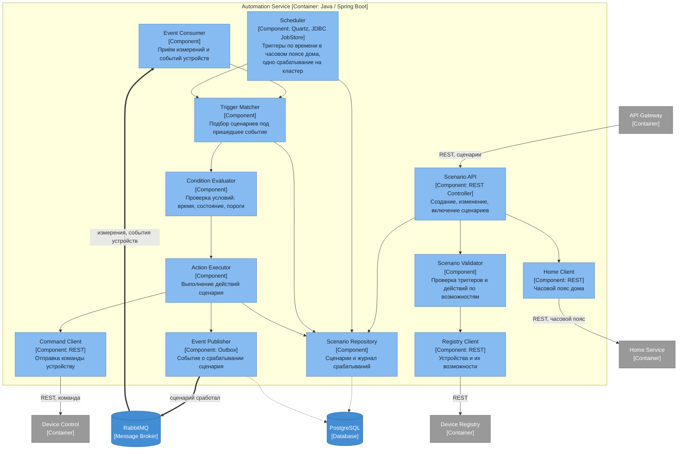

# Диаграмма компонентов — Automation Service

## Ответственности компонентов

| Компонент | Ответственность |
|---|---|
| Scenario API | Создание, изменение, включение и выключение пользовательских сценариев |
| Scenario Validator | Проверка того, что триггер и действие вообще применимы к выбранным устройствам |
| Registry Client | Получение списка устройств и их возможностей при составлении сценария |
| Event Consumer | Приём измерений и событий устройств из брокера |
| Trigger Matcher | Подбор сценариев, чей триггер совпал с пришедшим событием |
| Condition Evaluator | Проверка условий: время суток, состояние других устройств, пороги значений |
| Action Executor | Выполнение действий сработавшего сценария |
| Command Client | Синхронная отправка команды в Device Control — команде нужен ответ |
| Scheduler | Триггеры по времени: расписания, задержки, повторы. Quartz с хранением расписаний в собственной базе — срабатывание одно на весь кластер, пропущенные запуски догоняются после простоя |
| Home Client | Получение часового пояса дома при создании и изменении сценария |
| Scenario Repository | Сценарии, их расписания и журнал срабатываний |
| Event Publisher | Публикация факта срабатывания, на которую подписан Notification |

Команда уходит синхронным вызовом, а не событием: пользователю нужно знать, выполнилось ли действие. Само срабатывание при этом публикуется событием — на него реагируют уведомления, и им ответ не нужен.

Планировщик обязан быть кластерным. Сервис работает в нескольких репликах, и обычный планировщик Spring сработал бы на каждой: сценарий «в 22:00 включить свет» выполнился бы столько раз, сколько поднято реплик. Quartz с хранением расписаний в PostgreSQL берёт блокировку и гарантирует одно срабатывание, а заодно умеет догонять запуски, пропущенные во время простоя.

Время в расписании — время дома, а не сервера. «В 22:00» для домов в разных часовых поясах наступает в разные моменты, поэтому при создании и изменении сценария Automation запрашивает часовой пояс у Home Service и сохраняет его вместе со сценарием. Ходить за ним на каждое срабатывание не нужно — часовой пояс дома меняется редко, но при его смене сценарии дома придётся пересчитать.

Все сценарии исполняются в облаке. Задержка при этом невелика: длинный опрос доставляет команду хабу практически мгновенно. Но зависимость от связи прямая — при обрыве интернета автоматика не работает, дом остаётся управляемым только вручную. Это осознанное ограничение текущего этапа, снимается переносом простых правил на хаб.
