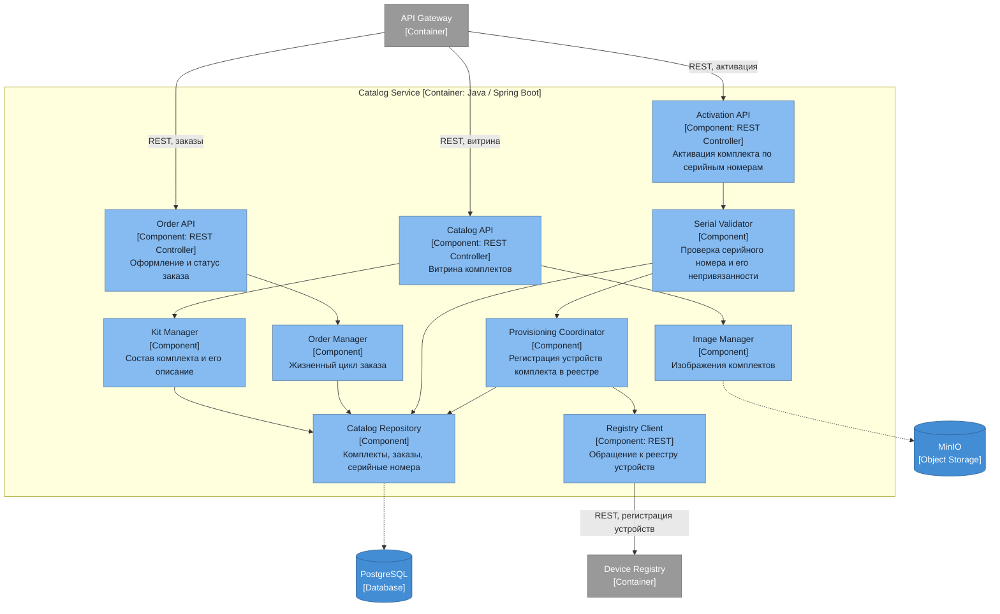

# Диаграмма компонентов — Catalog Service

## Ответственности компонентов

| Компонент | Ответственность |
|---|---|
| Catalog API | Витрина готовых комплектов с описанием и составом |
| Order API | Оформление заказа и его текущий статус |
| Activation API | Активация купленного комплекта по серийным номерам |
| Kit Manager | Состав комплекта: какие устройства и хаб в него входят |
| Order Manager | Жизненный цикл заказа от оформления до выдачи |
| Serial Validator | Проверка серийного номера: существует, принадлежит комплекту, ещё не привязан |
| Provisioning Coordinator | Доведение устройств комплекта до реестра, чтобы они появились у пользователя |
| Registry Client | Обращение к Device Registry при активации |
| Image Manager | Изображения комплектов в объектном хранилище |
| Catalog Repository | Комплекты, заказы и серийные номера |

Этот сервис закрывает требование о продаже готовых комплектов и делает связным путь от коробки в магазине до работающего устройства: заказ, активация серийников, появление устройств в реестре, подключение через хаб.

Активация затрагивает два сервиса, поэтому при неуспешной регистрации в реестре комплект должен остаться неактивированным — это место для саги с компенсацией.
