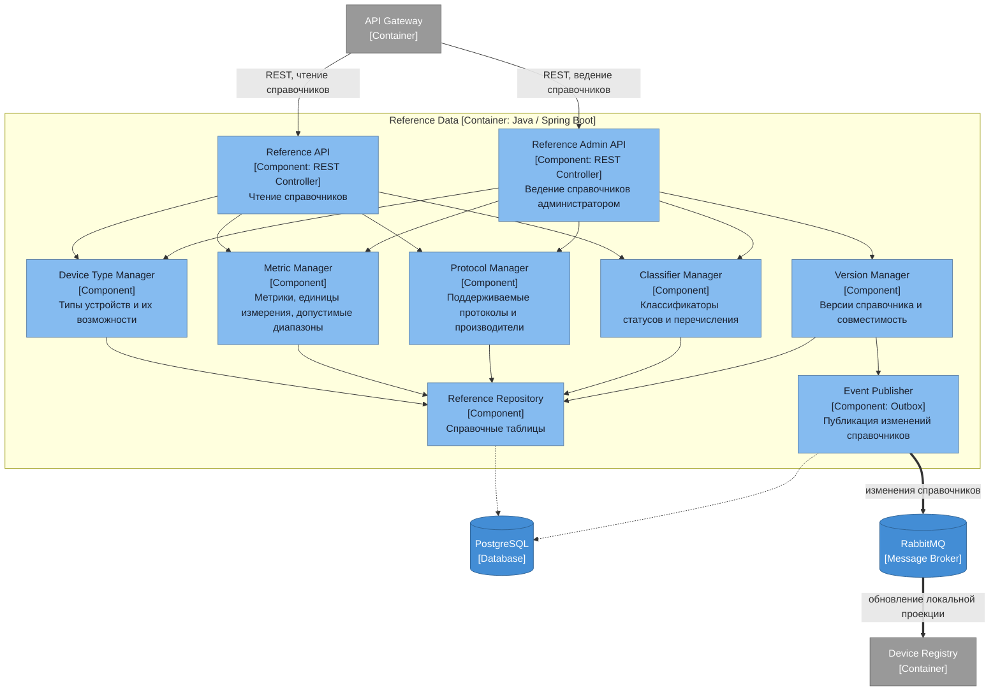

# Диаграмма компонентов — Reference Data

## Ответственности компонентов

| Компонент | Ответственность |
|---|---|
| Reference API | Чтение справочников клиентскими приложениями |
| Reference Admin API | Ведение справочников администратором: добавление типов, метрик, протоколов |
| Device Type Manager | Типы устройств и наборы их возможностей |
| Metric Manager | Метрики, единицы измерения, допустимые диапазоны значений |
| Protocol Manager | Поддерживаемые протоколы подключения и производители устройств |
| Classifier Manager | Классификаторы статусов и прочие перечисления |
| Version Manager | Версия справочника и совместимость с потребителями |
| Reference Repository | Доступ к справочным таблицам |
| Event Publisher | Публикация изменений, по которым потребители обновляют локальные копии |

Этот сервис — механизм расширяемости платформы. Подключение нового типа устройства партнёра сводится к записи в справочнике: не нужен ни релиз реестра, ни изменение схемы данных. Именно так закрывается требование ТЗ про «будущее неуточнённое поведение».

Синхронно к нему на каждый запрос никто не ходит: потребители держат локальные проекции и обновляют их по событиям. Иначе справочник станет общей базой для всех сервисов и превратит систему в распределённый монолит.
