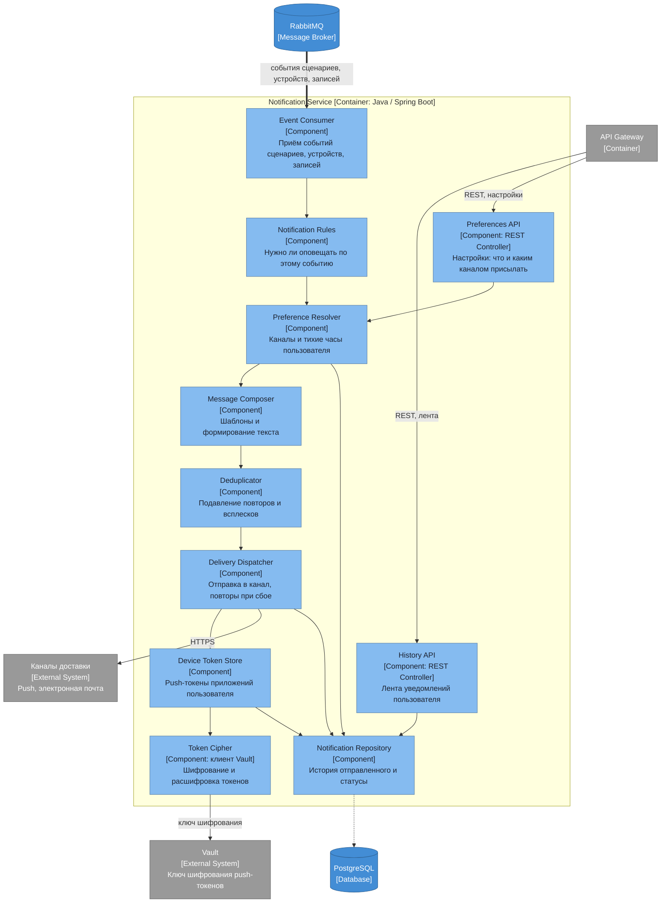

# Диаграмма компонентов — Notification Service

## Ответственности компонентов

| Компонент | Ответственность |
|---|---|
| History API | Лента уже отправленных уведомлений в приложении |
| Preferences API | Настройки пользователя: какие события и каким каналом присылать |
| Event Consumer | Приём событий о срабатывании сценариев, состоянии устройств и новых записях |
| Notification Rules | Решение о том, заслуживает ли событие уведомления |
| Preference Resolver | Каналы доставки и тихие часы конкретного пользователя |
| Message Composer | Формирование текста по шаблону с подстановкой устройства, дома и времени |
| Deduplicator | Подавление повторов: датчик, срабатывающий каждую минуту, не должен давать сто уведомлений |
| Delivery Dispatcher | Отправка во внешний канал и повтор при сбое доставки |
| Device Token Store | Push-токены приложений пользователя, хранятся в зашифрованном виде |
| Token Cipher | Шифрование и расшифровка push-токенов ключом из внешнего Vault. Токен предъявляемый, хешем его не заменить: при отправке нужно исходное значение |
| Notification Repository | История отправленного и статусы доставки |

Сервис полностью событийный: сам он никого не опрашивает, а реагирует на то, что публикуют другие. Наружу уходит через внешние каналы доставки — push-сервис платформы и электронную почту.
