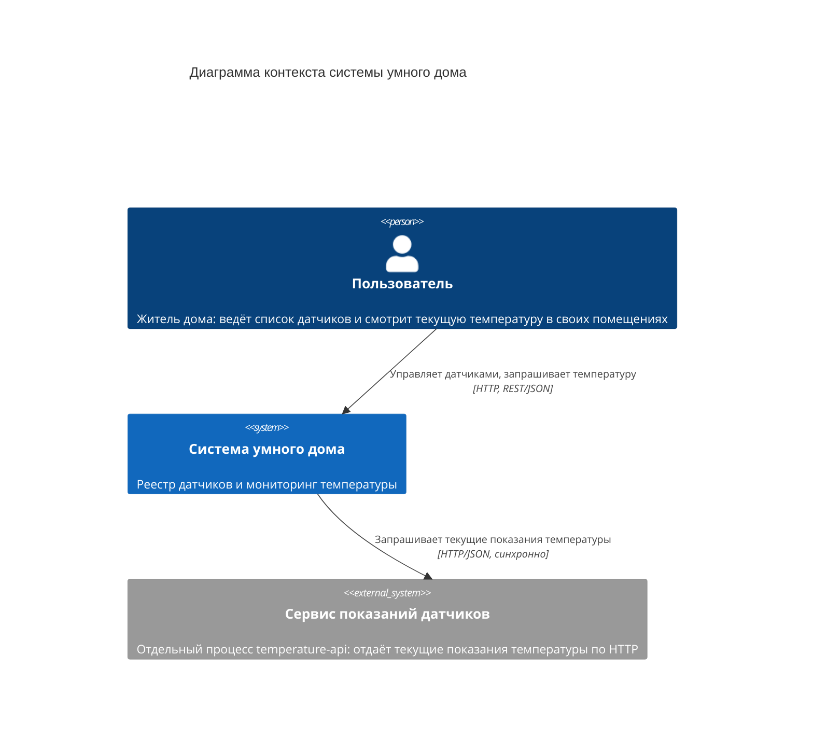

```mermaid
C4Context
    title Диаграмма контекста системы умного дома

    Person(user, "Пользователь", "Житель дома: ведёт список датчиков и смотрит текущую температуру в своих помещениях")

    System(smartHome, "Система умного дома", "Реестр датчиков и мониторинг температуры")

    System_Ext(tempApi, "Сервис показаний датчиков", "Отдельный процесс temperature-api: отдаёт текущие показания температуры по HTTP")

    Rel(user, smartHome, "Управляет датчиками, запрашивает температуру", "HTTP, REST/JSON")
    Rel(smartHome, tempApi, "Запрашивает текущие показания температуры", "HTTP/JSON, синхронно")
```