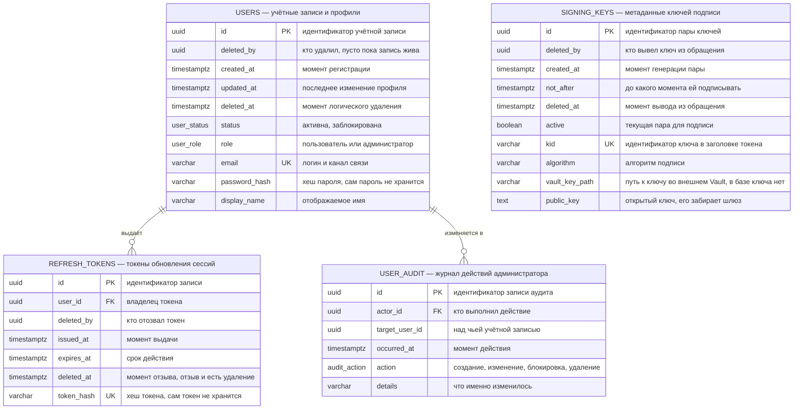
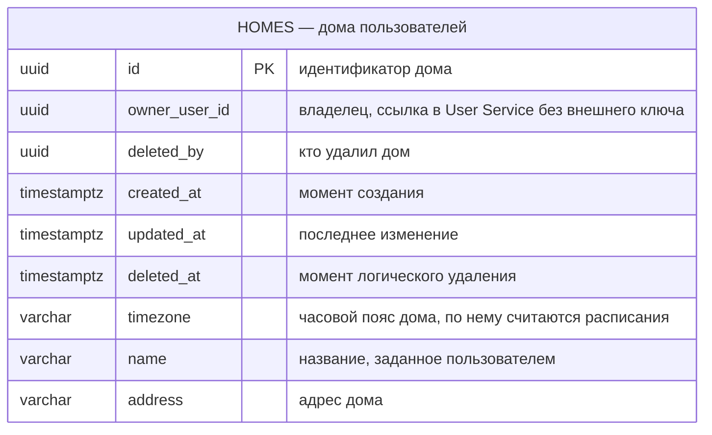
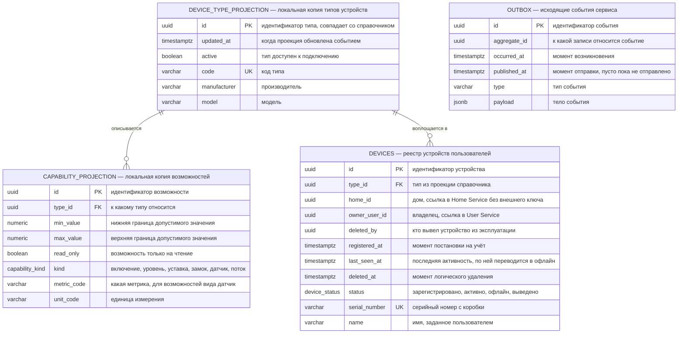
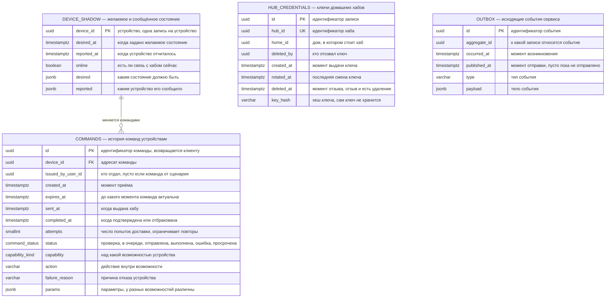
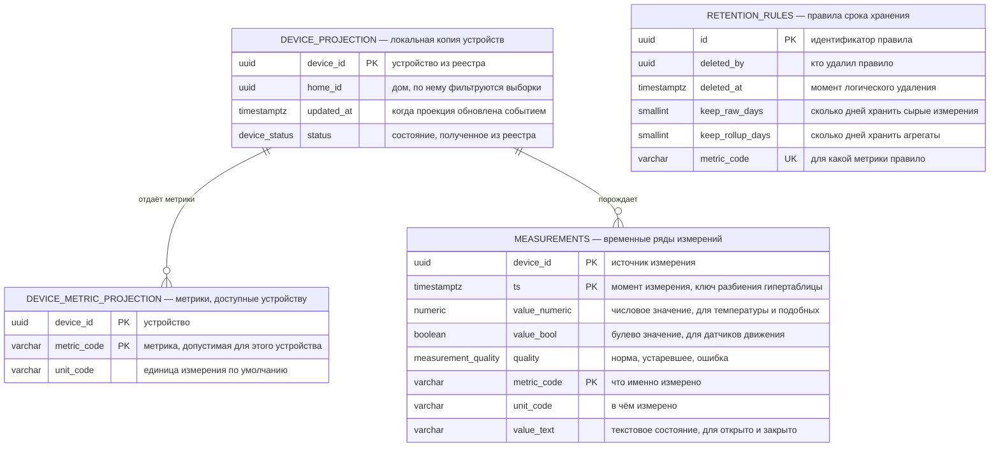
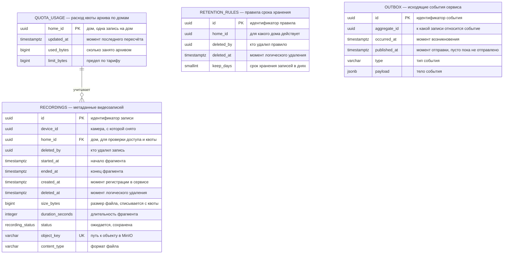
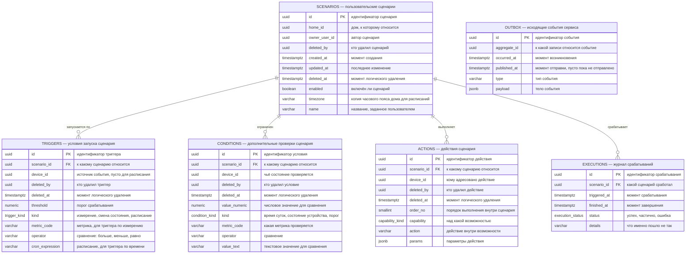
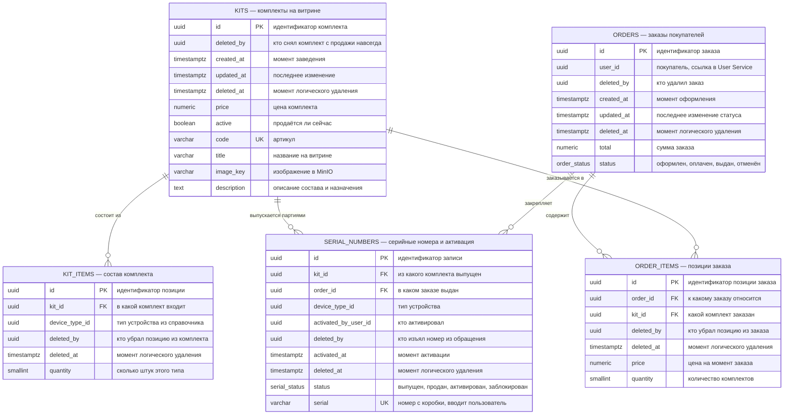
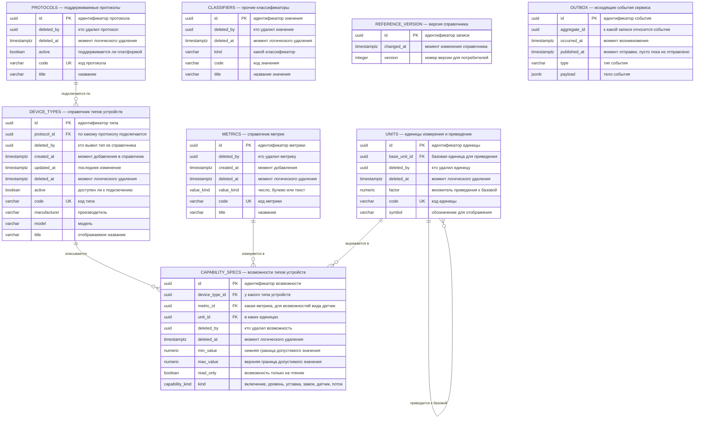
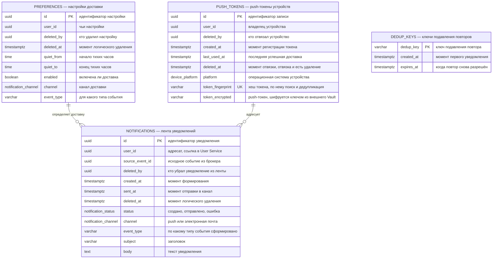

# ER-диаграмма

У каждого сервиса собственная база — общей схемы нет ни у кого. Поэтому диаграмма разбита на независимые блоки: по одному на сервис, владеющий данными в PostgreSQL. API Gateway в список не входит, у него только Redis со счётчиками частоты запросов.

**Связи между сервисами не являются внешними ключами.** Поля вроде `home_id` в реестре устройств или `user_id` в уведомлениях — это ссылки на сущности чужих баз, и целостность по ним обеспечивается не СУБД, а событиями и проверками при записи. Внутри одного блока внешние ключи настоящие.

**Удаление везде логическое.** Физического `DELETE` в бизнес-таблицах нет: запись помечается парой `deleted_at` и `deleted_by`, а данные остаются. Порядок колонок везде один: идентификаторы, затем поля фиксированной длины, затем переменной.

---

## 1. User Service

`SIGNING_KEYS` хранит **метаданные** ключей подписи, но не сам закрытый ключ. Он лежит во внешнем Vault, и подпись выполняется там же: сервис отправляет полезную нагрузку и получает подпись, ключ не попадает даже в память приложения. В базе остаются `kid`, алгоритм, срок действия и открытый ключ — по `kid` из заголовка токена шлюз находит, каким ключом проверять подпись.

Держать закрытый ключ в той же базе, что и таблицу `USERS`, было бы опасно несоразмерно: владение им даёт выпуск токена от имени любого пользователя, включая администратора, причём беззвучно — подделанный токен неотличим от настоящего.

`USER_AUDIT` — единственная таблица здесь без логического удаления: журнал аудита не удаляется вовсе, иначе он теряет смысл. Именно в нём остаётся след того, кто и когда удалил учётную запись.

---

## 2. Home Service

Одна таблица — и это честное отражение решений. Помещений нет: дом считается единым пространством. Совместного доступа нет: у дома один владелец, поэтому нет ни таблицы участников, ни таблицы прав.

`timezone` здесь не декоративное поле: по нему Automation считает расписания, иначе «в 22:00» срабатывало бы по времени сервера.

---

## 3. Device Registry

Две таблицы с суффиксом `PROJECTION` — локальная копия справочника, обновляемая событиями Reference Data. Логического удаления у них нет намеренно: это зеркало чужих данных, оно восстанавливается из событий и живёт ровно столько, сколько живёт оригинал.

`home_id` ссылается в чужую базу без внешнего ключа: существование дома подтверждается вызовом Home Lookup API при регистрации, дальше связь поддерживается событиями.

---

## 4. Device Control

Очереди команд и реестр соединений здесь отсутствуют намеренно — они живут в Redis, потому что это короткоживущее состояние с высокой частотой обращений. В PostgreSQL остаётся история команд, по которой можно ответить, что именно происходило с устройством.

`expires_at` и `attempts` — та самая пара, что реализует срок годности и ограничение повторов из диаграммы жизненного цикла команды.

`COMMANDS` и `DEVICE_SHADOW` логического удаления не имеют: история команд не удаляется пользователем, а теневое состояние живёт ровно столько, сколько живёт устройство.

`params` хранится как JSONB осознанно: у команд разных возможностей параметры принципиально разные, и раскладывать их по колонкам пришлось бы заново при каждом новом типе устройства. Это ровно тот случай, который отличается от значений измерений, где JSONB отвергнут.

---

## 5. Telemetry Service

`MEASUREMENTS` — гипертаблица TimescaleDB с разбиением по времени. Ключ составной: устройство, метрика и момент времени. Именно метрика в ключе позволяет комбинированному датчику отдавать температуру и влажность одновременно — в монолите это было невозможно, там один датчик равнялся одному значению.

Три колонки значения вместо одного универсального поля: `value_numeric`, `value_bool` и `value_text`. Датчик движения отдаёт булево, геркон — текстовое состояние, термометр — число. JSONB здесь отвергнут сознательно: по числовым рядам считаются агрегаты, и извлекать их из JSON на каждом запросе заметно дороже.

Логического удаления у измерений нет и быть не может: это миллиарды строк, которые удаляются политикой хранения целыми разделами. Пометка каждой строки удалённой лишила бы разбиение по времени всякого смысла.

---

## 6. Video Service

Файлов записей в базе нет — только `object_key`, путь к объекту в MinIO. Сам файл идёт от хаба в хранилище и обратно в приложение по подписанным ссылкам, минуя сервис.

Здесь логическое удаление работает в два такта и это стоит оговорить: запись помечается удалённой сразу, а файл из MinIO уходит отложенно, по истечении срока хранения. Пока файл на месте, удаление обратимо — пользователь может передумать.

---

## 7. Automation Service

`timezone` дублируется из Home Service намеренно: он копируется в сценарий при создании, чтобы планировщик не ходил за ним на каждое срабатывание. Плата за это — необходимость пересчитать сценарии дома при смене его часового пояса.

Удаление сценария помечает удалёнными и его триггеры, условия и действия — каскад тоже логический. Благодаря этому журнал `EXECUTIONS` остаётся читаемым: по нему видно, какой именно сценарий сработал, даже если пользователь давно его удалил. Сам журнал логического удаления не имеет и чистится по сроку хранения.

К этим таблицам добавляются служебные таблицы Quartz для хранения расписаний и блокировок — они создаются самой библиотекой и на диаграмме не показаны.

---

## 8. Catalog Service

`SERIAL_NUMBERS` — место стыковки коммерции и техники. Уникальность серийного номера и его статус не дают активировать один комплект дважды, а `activated_by_user_id` связывает покупку с учётной записью.

Разница между `active` и `deleted_at` у комплекта существенна и её стоит держать в голове: первое снимает комплект с витрины временно, второе убирает его навсегда, но сохраняет для уже оформленных заказов — иначе в истории покупок появились бы пустые строки.

---

## 9. Reference Data

Это механизм расширяемости платформы в виде таблиц. Подключение нового типа устройства партнёра — строка в `DEVICE_TYPES` и несколько строк в `CAPABILITY_SPECS`. Ни реестр, ни Device Control при этом не меняются и не пересобираются.

Логическое удаление здесь особенно важно: на записи справочника ссылаются устройства в чужой базе. Физическое удаление типа устройства превратило бы уже зарегистрированные устройства в записи с ссылкой в пустоту. Удаление типа помечается датой, событие уходит потребителям, а существующие устройства продолжают работать по сохранённой в проекции копии.

`UNITS` ссылается сам на себя через `base_unit_id` и `factor`: так показания в разных шкалах приводятся к одной, иначе агрегаты по температуре считались бы по смеси значений.

---

## 10. Notification Service

`DEDUP_KEYS` подавляет повторы: датчик движения, срабатывающий каждую минуту, не должен давать шестьдесят уведомлений в час. Ключ живёт ограниченное время и удаляется по истечении — логическое удаление здесь не нужно, запись и так техническая и короткоживущая.

Push-токен — предъявляемый секрет: с ним можно слать уведомления пользователю от имени приложения. Хешем его не заменить, потому что при отправке нужно исходное значение, поэтому колонка шифруется ключом из Vault. Рядом лежит `token_fingerprint` — хеш для поиска и защиты от дублей, по зашифрованной колонке уникальность не построишь.

---

## Сквозные решения

**Удаление везде логическое.** Пара `deleted_at` и `deleted_by` есть во всех бизнес-таблицах. Физического `DELETE` нет: удалённая учётная запись сохраняет свои дома, устройства и историю, и остаётся ответ на вопрос, кто и когда её удалил. Из этого следуют три обязательных правила реализации:

- каждый запрос на чтение фильтрует по `deleted_at IS NULL`, иначе удалённое начнёт всплывать в выборках;
- уникальные индексы становятся частичными, с тем же условием — иначе освободившийся адрес электронной почты или серийный номер нельзя будет использовать повторно;
- каскад удаления тоже логический: удаление сценария помечает его триггеры, условия и действия, а не стирает их.

**Где логического удаления нет и почему.** `MEASUREMENTS` — миллиарды строк, удаляются политикой хранения целыми разделами. `OUTBOX` и `DEDUP_KEYS` — технические записи, исчезающие после отправки или по таймеру. `USER_AUDIT` и `EXECUTIONS` — журналы: первый не удаляется вовсе, второй чистится по сроку хранения. `COMMANDS`, `DEVICE_SHADOW`, `QUOTA_USAGE` и четыре таблицы-проекции — производное состояние, живущее ровно столько, сколько живёт его источник. `REFERENCE_VERSION` — счётчик версий, который только растёт.

**Флаг доступности и дата удаления — разные вещи.** `active` и `enabled` означают «выключено сейчас, можно включить обратно»: комплект снят с витрины, сценарий приостановлен, тип устройства временно недоступен. `deleted_at` означает «убрано насовсем, но данные сохранены ради целостности истории». Смешивать их нельзя — иначе нельзя будет отличить приостановленный сценарий от удалённого.

**Настоящие секреты в базах не лежат.** Их два, и оба во внешнем Vault — готовом приложении для хранения секретов и параметров конфигурации, откуда все сервисы забирают и свои настройки: закрытый ключ подписи токенов у User Service и ключ шифрования push-токенов у Notification Service. В базе от первого остаются метаданные и открытый ключ, от второго — зашифрованное значение. Граница проходит по признаку «можно ли этим воспользоваться»: если да — место в Vault, если только проверить предъявленное, как хешем пароля, — место в базе.

**Хеши вместо секретов.** Пароли, токены обновления и ключи хабов хранятся только как `password_hash`, `token_hash`, `key_hash`. Это не секреты, а верификаторы: предъявить их нельзя, ими можно только проверить предъявленное. Выносить их в Vault было бы неправильно и технически — это данные с реляционным жизненным циклом, привязанные к строкам, которых миллионы.

**Идентификаторы везде `uuid`, а не последовательности.** Устройства приходят от партнёров и регистрируются с разных сторон, так что идентификатор должен порождаться без обращения к общей базе. Это же избавляет от угадывания чужих записей перебором.

**Перечисления вынесены в типы PostgreSQL** (`device_status`, `command_status`, `capability_kind` и прочие), а не хранятся строками: база сама не даст записать несуществующее состояние.
